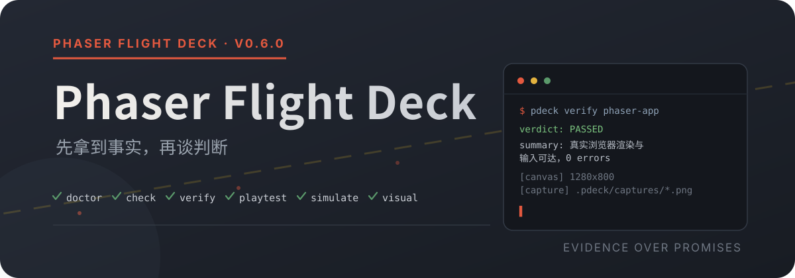

<p align="center">
  
</p>

<p align="center">
  <a href="https://github.com/sumo91/phaser-flight-deck/releases/tag/v0.6.0"></a>
  <a href="./LICENSE"></a>
  <a href="./package.json">= 20" src="https://img.shields.io/badge/node-%3E%3D20-6B6258?style=flat-square"></a>
  <a href="https://github.com/sumo91/phaser-flight-deck/actions/workflows/test.yml"></a>
</p>

<p align="center">
  <a href="#快速安装">快速安装</a> ·
  <a href="#玩测剧本">玩测剧本</a> ·
  <a href="#剧本驱动视觉回归">视觉回归</a> ·
  <a href="#命令总表">命令总表</a> ·
  <a href="#仓库结构">仓库结构</a> ·
  <a href="https://github.com/sumo91/phaser-flight-deck/issues">提交问题</a>
</p>

> 让 Agent 写 Phaser 游戏，半天就能收到一屏代码。难点在交活那一刻，它自己怎么知道游戏真的能玩？tsc 通过、构建成功，游戏照样可以卡在标题屏挂一晚上。

pdeck 是给 Agent 配的检查工具箱。写代码的时候查项目健康、扫 v4 已移除的 API、直接问类型定义事实，少踩官方文档没写的坑；交活之前，把游戏在真实浏览器里跑起来，让机器人玩家按剧本玩一遍，画面跟基线逐像素比对，数值交给无头模拟跑几十个小时挂机。Agent 用它在交付前自己把问题找完，交到你手上的是一个跑得通的游戏。

每个命令的输出都是同一种格式，裁决加证据加下一步。Agent 汇报"验证过了"的时候，截图在哪、哪步断言通过，点开就能复核。

CLI 零依赖，clone 下来就能跑。浏览器相关命令需要系统 Chrome 或 Edge，缺失时如实报 INCONCLUSIVE 附安装指引。

*English readers can pass `--json` on any command to get a bounded envelope with a verdict, evidence facts and deterministic next steps.*

## 它做什么

**先拿到事实。** `verify` 走一条从窄到宽的阶梯，版本一致性、tsc、生产构建、真实浏览器里恰好一个可见 canvas、零页面异常、输入可达，第一处硬失败即定裁决。启动必须实测，HTTP 双栈探测加 pid 存活检查，没验证过的启动和别的服务器的响应都不会被报成成功。doctor 会对照 registry 报告 Phaser 4.2.1 的发布静默期，规则表全部带版本号。

**让机器人真的玩。** `run playtest` 用 JSON 剧本在真实 UI 上按键、点击、断言、存值、截图，断言直调项目 DEV 句柄（`window.__game`、`window.__session`），设计逻辑就此挂进玩测。跨步骤对比用 `store` 存值、后续步骤 `{{变量}}` 引用；时序敏感的断言带 `within` 轮询。这两个功能都是被真实失败教出来的，来历见玩测剧本一节。

**数值和画面都看得住。** 核心逻辑零 Phaser 依赖的项目可以无头跑几十个小时挂机，`simulate` 拿 profile 区间当平衡回归门，越界即 FAILED。视觉回归支持剧本驱动，先把游戏推进到战斗中或第 4 天农田这类状态，再采基线、做像素比对。两个真实项目上测过，确定性状态同态 0.00%，战斗画面同态 0.68%，动画帧差就长这个样子。

## 快速安装

**A. 直接用（零安装）**

```bash
node <本目录>/cli/pdeck.mjs <command> ...      # 核心命令零依赖
npm install                                    # 浏览器相关命令需要 playwright-core
```

**B. 全局命令**

```bash
cd <本目录> && npm install && npm link          # link 直连仓库，仓库升级自动跟随
pdeck doctor <项目目录>
```

**C. Pi Agent 集成**

```bash
pi install <本目录>                            # 全局；或 cd <项目> && pi install -l <本目录> 项目级
```

手工注册则在 settings.json 的 extensions 数组加入 `<本目录>/extensions/phaser-flight-deck.ts`，skills 数组加入 `<本目录>/skills/phaser4-flight-deck`。装完 `/reload`，会话拿到 11 个工具和 3 个命令。

**D. 跨工具技能（~/.agents/skills）**

```bash
mkdir -p ~/.agents/skills/phaser-flight-deck
cp <本目录>/skills/phaser4-flight-deck/SKILL.md ~/.agents/skills/phaser-flight-deck/
```

技能分三处。`skills/phaser4-flight-deck/` 是源，改这里；`~/.agents/skills/phaser-flight-deck/` 是给扫约定目录的 CLI 用的安装位，升级本工具后重拷一次；`dist/` 里 Claude Code、Cursor、Codex 的技能包由 `npm run generate` 再生成。源和安装位并存时加载器会报同名冲突并取其一，内容一致就无害，想消掉提示删掉其中一处注册即可。

平台支持 Windows / macOS / Linux。端口预检和进程归属校验两边都做了，Windows 走 netstat 双栈加 wmic，POSIX 走 lsof、ss 加 ps。

## 快速开始

```bash
pdeck doctor <项目>                              # 项目健康：版本对照/工具链/core 隔离
pdeck check <项目>                               # v4 API 静态扫描 + 纹理 key 校验
pdeck api query fillPoints <项目> --depth 3      # d.ts 预言机
pdeck api exists setTintFill <项目>              # 存在性 + 已移除 API 交叉核对
pdeck verify <项目>                              # 验证阶梯：tsc→构建→真实浏览器→截图证据
pdeck run serve <项目>                           # dev server 生命周期（端口预检+双栈实测）
pdeck run observe <项目>                         # 复合观察：按需起服务→console→自动清理
pdeck run snapshot http://localhost:5173/
pdeck run playtest <剧本.json> <项目>            # 机器人玩家玩测
pdeck baseline demo <项目>                       # 视觉回归基线（入口态）
pdeck baseline battle <项目> --script 剧本.json --at-step 8   # 剧本驱动到游戏内状态再采基线
pdeck visual-test demo <项目>                    # 与基线像素比对
pdeck visual-test battle <项目> --script 剧本.json  # 同剧本驱动到同状态后比对
pdeck simulate <项目>                            # 平衡模拟门（需 test/simulate 契约 + 剖面）
pdeck regression <项目>                          # 一条命令跑完整全量回归 + json/md 报告
pdeck init <新目录>                              # 保守脚手架（dry-run 默认，--apply 提交）
pdeck evidence <项目>                            # 验证证据索引
```

所有命令支持 `--json` 与 `--timeout`。完整契约用 `pdeck describe <command> --json` 查。

## 命令总表

| 命令 | 职责 | 风险 |
|---|---|---|
| `pdeck doctor` | 项目健康（Phaser 识别、版本对照静默期感知、工具链、core 隔离） | 只读 |
| `pdeck check` | 19 条 v4 API 规则扫描 + 纹理 key 校验（动态工厂误报抑制） | 只读 |
| `pdeck api` | d.ts 预言机（query / exists 含已移除 API 交叉核对 / version / describe） | 只读 |
| `pdeck verify` | 验证阶梯（版本→tsc→构建→真实浏览器→截图证据，落 .pdeck/） | generated-write |
| `pdeck run` | serve（端口预检+双栈实测）/ snapshot / console（良性404过滤）/ probe / watch / observe（自动起停复合观察）/ playtest（剧本驱动机器人玩家） | generated-write |
| `pdeck baseline` / `visual-test` | 视觉回归（基线截图 + 浏览器解码逐像素比对；`--script` + `--at-step` 剧本驱动到游戏内任意可达状态；基线互为副本时告警） | generated-write |
| `pdeck simulate` / `simulate-profile` | 平衡模拟门（项目 test/simulate 契约 + 剖面区间回归检查） | 只读 / 生成写 |
| `pdeck regression` | 全量回归组合（doctor→check→verify→simulate→visual 串行，出一份有界信封加 json/md 报告） | generated-write |
| `pdeck evidence` | 验证证据索引（裁决/新鲜度/耗时/基线健康） | 只读 |
| `pdeck init` | 保守脚手架（dry-run 默认，--apply 提交；从不代跑 npm install） | project-write |
| `pdeck vendor-skills` | vendor 官方 skills（git clone 钉版 tag） | host-write |

风险分级接 Pi 确认门。只读直接执行；写入类首次触发时三选一（永久授权写 trust.json 可撤销 / 仅本次会话 / 拒绝，300s 窗口），`/pdeck-authorize` 随时可查可调。

## 玩测剧本

JSON 剧本让机器人玩家在真实 UI 上玩，顺手把设计逻辑断言进去。这是 StarValley 项目里实测通过的一版，开局、等加载、存起点、向右走、断言位移。

```json
{
  "name": "开局走一步",
  "steps": [
    { "do": "wait", "ms": 800 },
    { "do": "press", "key": "Enter" },
    { "do": "expect", "that": "已进入游戏", "eval": "() => !!(window.__session && window.__session.time)", "within": 4000 },
    { "do": "store", "as": "startX", "within": 3000, "eval": "() => { const s = window.__game.scene.scenes.find(x => x.scene.key === 'Farm'); return s && s.player ? s.player.x : null; }" },
    { "do": "hold", "key": "d", "ms": 800 },
    { "do": "expect", "that": "玩家向右移动了", "eval": "() => { const s = window.__game.scene.scenes.find(x => x.scene.key === 'Farm'); return !!(s && s.player && s.player.x > {{startX}}); }" },
    { "do": "capture", "as": "moved" }
  ]
}
```

| 动作 | 字段 | 说明 |
|---|---|---|
| `press` / `hold` | `key`（hold 另需 `ms` ≤10000） | 键盘；`click` 用 `x,y` 坐标 |
| `wait` | `ms` | 等待 |
| `expect` | `that`、`eval`、可选 `within` | 页面内求值，假值/抛错 → FAILED（事实带步骤号）；`within` 毫秒窗口内轮询直到满足 |
| `collect` | `that`、`eval` | 页面内求值并作为证据记录（有界） |
| `store` | `as`（变量名）、`eval`、可选 `within` | 求值存入剧本变量，后续步骤字符串里 `{{变量名}}` 引用（替换为 JSON 字面量）；`within` 轮询到值非空再冻结 |
| `capture` | `as` | 截图落 `.pdeck/captures/playtest-<as>-*.png` |

`eval` 支持 `'() => …'` 函数串和 `'…'` 纯表达式两种形式，在页面里执行，能调项目暴露的任何 DEV 句柄。

`within` 是被失败教出来的。最早的示例剧本连栽三次，全是按了键但状态没就绪。后来在 SwordIdle 又碰上一回，击杀递增断言前面 `wait 4000`，首次击杀偶尔超过四秒，断言就碎。加上 `within 8000` 后这类时序交给轮询消化，超时才失败，失败事实里带实际等待时长和最后一次求值错误。

`store` 的 `within` 同样有来历。场景没就绪时存玩家坐标会冻下一个 `null`，插值后 `{{startX}}` 永远是 null，断言必假。所以 store 轮询到值非空才冻结，把瞬态 null 挡在外面。

服务生命周期同 observe，`--url` 直连运行中的页面，否则自动起停自己的服务。剧本校验（≤64 步、动作字段合法）在起浏览器之前完成，错误信息带步骤号。

## 剧本驱动视觉回归

默认的视觉回归只能截 URL 入口态，也就是标题屏。加 `--script` 后复用玩测内核，先把游戏驱动到任意可达状态再采基线、做比对；`--at-step N` 只执行剧本前 N 步，比如用日结算剧本的前 10 步停在"第 4 天农田"。

```bash
pdeck baseline day4 <项目> --script test/playtest/day-cycle.json --at-step 10
pdeck visual-test day4 <项目> --script test/playtest/day-cycle.json --at-step 10
```

- 基线与比对必须同剧本、同 `--at-step`，两边才到得了同一状态。剧本断言失败时如实 FAILED，基线不落盘，比对不执行
- 剧本态走 dev server（自动起停），入口态默认走 dist 静态服务，两种模式语义不同，基线别混用
- 动态画面天然帧帧不同，战斗同态 0.68% 属正常，重特效场景按需上调 `--tolerance`（如 0.1）
- 怀疑"空转通过"时有个直接的验证办法，拿另一个项目的截图冒充基线比一次，93.38% 差异立刻 FAILED。0% 的通过是真的 0%
- 基线健康审计。两个试用项目里各躺着一组三张基线，哈希一算其实是一张图复制三份，工具当时沉默。现在 `visual-test` 会点名所选基线的副本组，`evidence` 列出全部

## Pi 集成

安装后会话获得工具 `pdeck_project` · `pdeck_check` · `pdeck_api` · `pdeck_validate` · `pdeck_run` · `pdeck_init` · `pdeck_evidence` · `pdeck_vendor` · `pdeck_visual` · `pdeck_simulate` · `pdeck_regression`，快捷命令 `/pdeck-doctor` · `/pdeck-verify` · `/pdeck-authorize`。写入类操作首次触发走上面说的三选一授权。

## 知识层与多宿主

`skills/phaser4-flight-deck/` 是自研主技能，装的是架构约定（core 零 Phaser 依赖）加实测踩坑录，addCanvas 大纹理 GPU ReadPixels 卡死、纹理按外观规格缓存、场景生命周期顺序、AudioContext 调度死循环、d.ts 残留声明在运行时并不可用、vite 只绑 [::1]。`skills/vendor/` 由 `pdeck vendor-skills` 从 phaserjs/phaser 钉版 tag 引入官方技能（4.0 基线）。

`npm run generate` 从单一契约源（`registry/commands.mjs` 加主技能）生成各宿主适配器包到 `dist/`（已提交，安装方式见 `dist/README.md`）。适配器只做提示，业务逻辑永远在 CLI 一处。

| 宿主 | 包内容 | 确认门 |
|---|---|---|
| **Claude Code** | skills + `/pdeck-*` 4 个 slash commands + PreToolUse hooks | hooks 拦截写入类命令（最强） |
| **Cursor** | `.cursor/commands/` 4 个命令入口 + 技能 | prompt 约定（无 hooks） |
| **Codex** | `$HOME/.agents/skills/` 技能包 | prompt 约定 |
| **Pi** | extensions（11 工具 + trust.json 授权） | 工具内确认门（已有） |

一致性由 `tests/adapters.test.mjs` 守护，命令覆盖率、宿主差异、MANIFEST 哈希、hooks 拦截清单都在里面。

## 运维规则

1. **新工具 = 新会话**。扩展新增或修改工具后，当前会话的工具集是启动快照，要 `/reload` 或重启 Pi 才生效。CLI 每次都是新进程，命令层改动立即生效。
2. **工具目录别移动**。settings.json 里是绝对路径注册，移动后同步改 extensions 和 skills 数组。
3. **撤销授权**。删除工具目录 `trust.json` 或其中对应条目，`/pdeck-authorize` 可查看。
4. **vendor-skills 需要 GitHub 可达**。网络受限环境会快速 INCONCLUSIVE，可在可达环境执行后复制 `skills/vendor/`，或按 `skills/vendor/README.md` 手动操作。
5. **端口冲突策略**。`run serve` 预检拒绝外来占用，避免 localhost URL 歧义，换 `--port` 或先确认占用者。`run observe|playtest` 自己起停自己的服务，未显式指定端口时默认口被占会自动尝试 5173-5178 候选，显式 `--port` 仍严格拒绝。

## 测试

```bash
npm test                                          # 76 项 = 70 CLI 回归 + 6 适配器一致性（校验已提交的 dist）
PDECK_TEST_FIXTURE=<Phaser项目路径> npm test      # 附带真实项目集成（verify 阶梯、serve 生命周期、视觉自比对、模拟门、玩测）
# 未设置夹具时集成测试自动跳过（58 通过 / 12 跳过）
```

CI 是 ubuntu/windows × Node 20/24 矩阵，Windows 专项代码（netstat 双栈、taskkill、npm.cmd、端口回退）每轮都真实执行。

## 仓库结构

```
cli/pdeck.mjs            零依赖 CLI 入口（参数解析/嵌套动作路由/信封包装）
cli/result-envelope.mjs  有界证据优先信封（与 Pi 共用）
cli/lib/                 项目探测 / registry 对照 / v4 规则表 / 浏览器驱动 / 静态服务器 / 视觉比对 / 控制台分类 / 子进程
cli/commands/            doctor / check / api / verify / run / init / evidence / vendor / visual / simulate / regression
registry/commands.mjs    单一契约：CLI 选项、命令、Pi 字段 schema、风险分级
extensions/              Pi 薄封装扩展（参数映射+确认门+Envelope 透传）
skills/                  自研主技能 + 官方技能 vendor
probes/                  运行时探针契约（window.__pdeck，pdeck run probe 消费）
templates/project/       init 脚手架模板（Phaser 4.2.1 钉版）
tests/                   node --test 回归（76 项：cli.test + adapters.test）
scripts/                 generate-adapters.mjs（多宿主适配器生成器，零依赖；--out 可指定输出目录）
dist/                    生成的宿主适配器包（已提交，测试守护其与契约源新鲜一致）
.github/workflows/       CI 矩阵
```

## 排障记录

Windows spawn/shell、netstat 双栈、vite 只绑 [::1]、端口共存歧义、npm.cmd 进程孤儿，这些真实环境坑的定位和对策都在 [CHANGELOG.md](CHANGELOG.md)，按版本翻。

## Contributing

欢迎 issue 和 PR。所有逻辑改动必须过 `npm test`；影响命令契约的改动同步更新 `registry/commands.mjs`（单一契约源）；新增命令走 CLI 命令模块 → 注册表 → pdeck.mjs 路由 → 测试 → CHANGELOG 这条路；风险分级只增不减，新写入类操作必须声明 risk 并在扩展确认门中处理。

## License

[MIT](LICENSE) © 2026 Phaser Flight Deck contributors
